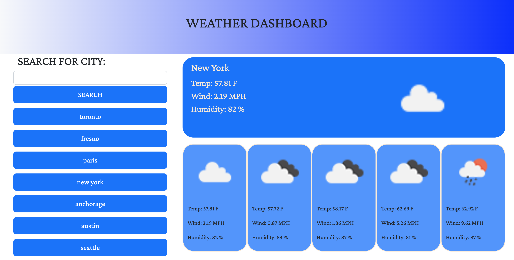

  # Weather Dashboard 

  ## TABLE OF CONTENTS
  * [Description](#description)
  * [Installation](#installation)
  * [Usage](#usage)
  * [Tests](#tests)
  * [FAQ](#faq)

  ## DESCRIPTION
  Use Open Weather Map API to get todays weather and the five day forecast for a city of your choosing! After you've searched a city, it will be avaible in local storage at the click of a button to view those stats again!

    Deployed App: https://shadin-a.github.io/MODULE6-WEATHER-DASHBOARD/

  ## INSTALLATION
 No installation for this application. Simply visit the link for the deployed application!

  ## TESTS
No tests for this iteration of the Weather Dashboard. Check again soon!

  ## USAGE
  

  ## FAQ
  * shadin.alarab@gmail.com
  * https://github.com/shadin-a
  * Feel free to reach me via my carrier pigeon, Hank.

  # LICENSE
  
  Licensed by https://opensource.org/licenses/MIT